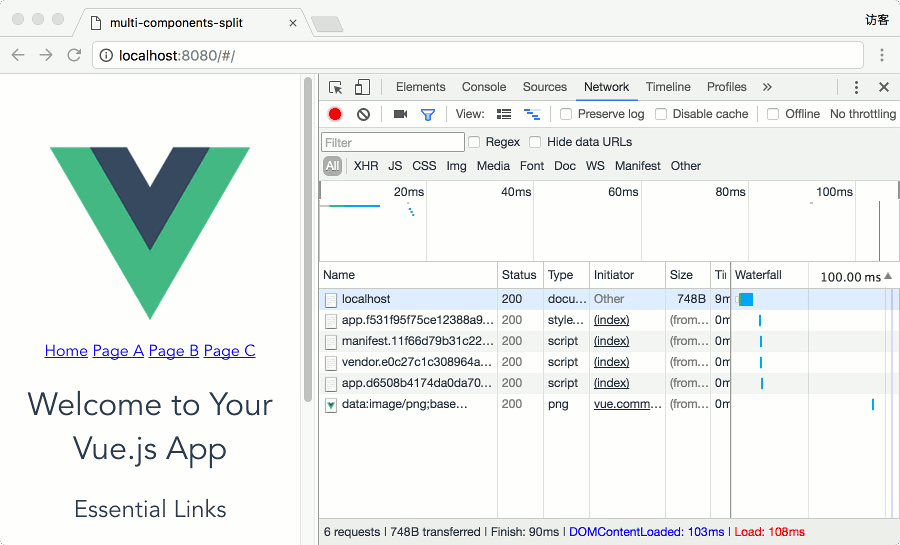
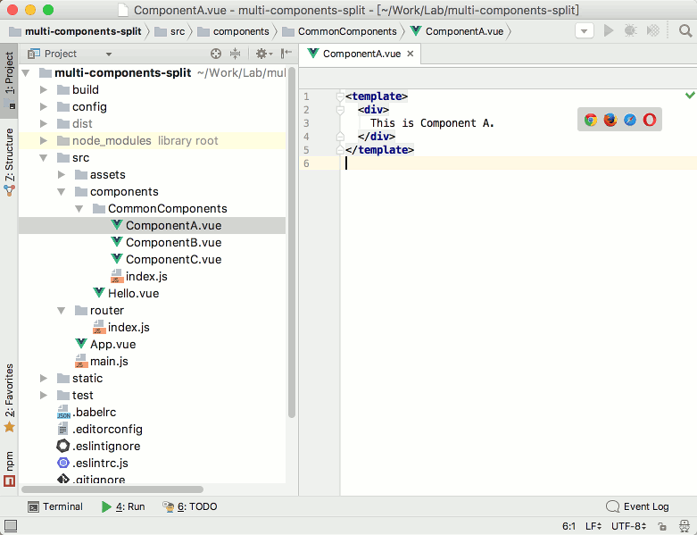
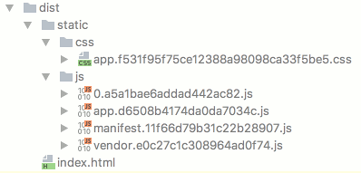

## Vue 项目中使用 webpack 将多个组件合并打包并实现按需加载

### Vue 异步组件

使用 Vue 开发项目时，如果要使用其单文件组件特性，必然要使用 webpack 或者 Browserify 进行打包，对于大型应用，为了提升加载速度，可以使用 webpack 的 code splitting 功能进行分割打包，生成较小的模块并按需加载，这在 Vue 文档及 vue-router 文档中均有介绍：[Async Components](http://vuejs.org/v2/guide/components.html#Async-Components)、[Lazy Loading](http://router.vuejs.org/en/advanced/lazy-loading.html)。

webpack 的 code splitting 可以使用 webpack 的 require.ensure 特殊语法或者使用 AMD 风格的 callback-require 语法，以 AMD 风格的 callback-require 语法为例——

全局注册 Async Component：
```javascript
let myAsyncComponent = resolve => {
  require(['./my-async-component'], resolve)
}
Vue.component('async-webpack-example', myAsyncComponent)
```
局部注册 Async Component，单文件组件中 script 块内容：
```javascript
let myAsyncComponent = resolve => {
  require(['./my-async-component'], resolve)
}

// Vue 扩展实例选项，其他选项略
export default {
  components: {
    'async-webpack-example': myAsyncComponent
  }
}
```
在使用 vue-router 时，为实现不同路由下的组件异步加载，在路由映射中可以使用同样的方式来设置路由项的 component 属性。

这里的 myAsyncComponent 被定义为一个工厂函数，在需要时才会以 Vue 或者 vue-router 定义的用于解析组件选项的 resolve 回调函数（是的，在 Vue 和 vue-router 中有两个不同的解析组件选项的函数）为参数执行 callback-require 函数（resolve 回调函数的参数是组件选项），这样，在执行打包脚本时，my-async-component.vue 文件会被单独打包成一个文件，并且仅当该组件被使用时才会加载。

### 多组件合并打包需求

当要求异步加载的组件较多时，将会生成更多的单个文件，对于前端性能而言，虽然每个文件更小了，但可能意味着更多的网络连接建立和关闭的开销，因此在前端优化的实践中，通常需要在文件数量和单个文件大小之间取得平衡。

本文介绍如何将多个组件合并打包成一个单独的文件，一方面可以减少代码块的数量，另一方面，如果合并打包的这些组件在不同地方多次重复使用，由于 Vue 的缓存机制，可以加快后续组件的加载速度，并且如果这些通用组件长时间不会变化（如 UI 相关的组件），打包生成的文件也长期不会变化，可以充分利用浏览器的缓存功能，实现前端加载速度的优化。

先上效果图，在使用 vue-router 的 SPA 应用中，将除根路由之外的路由项对应的 ComponentA、ComponentB、ComponentC 等三个组件合并打包成一个文件。初次加载页面时，从开发者工具的 Network 面板上可以看到，此时未加载包含 ComponentA、ComponentB、ComponentC 这三个组件的 0.a5a1bae6addad442ac82.js 文件，当点击 Page A 链接时，加载了该文件，然后再点击 Page B、Page C 链接时，没有重新加载该文件。



### 多组件合并打包方法

我们首先通过 vue-cli 命令行工具使用 webpack 项目模板创建一个包含 vue-router 的项目，在其 src/components 目录下创建一个 CommonComponents 目录，在该目录中创建 ComponentA、ComponentB、ComponentC 这三个组件。



同时在 CommonComponents 目录下创建 index.js，其内容如下：
```javascript
exports.ComponentA = require('./ComponentA')
exports.ComponentB = require('./ComponentB')
exports.ComponentC = require('./ComponentC')
```

这样，我们只需要使用 webpack 的 require.ensure 特殊语法或者使用 AMD 风格的 callback-require 语法异步加载 CommonComponents 目录下的 index.js，在使用 webpack 进行打包时，就可以实现将 ComponentA、ComponentB、ComponentC 这三个组件合并打包。以 AMD 风格的 callback-require 语法为例示范如下，这里的 callback 回调函数的形式没有任何特殊要求。
```javascript
require(['components/CommonComponents'], function (CommonComponents) {
  // do whatever you want with CommonComponents
})
```
components/CommonComponents 模块加载成功时，这里的回调函数中的 CommonComponents 参数将会是一个包含 ComponentA、ComponentB、ComponentC 这三个组件选项的对象。

在定义异步组件时，我们使用的是一个工厂函数 `resolve => {require(['./my-async-component'], resolve)}`，如果需要在路由配置文件中添加 component 属性为 ComponentA 组件的路由项，应该定义什么什么样的工厂函数呢？记住这里的 resolve 是一个用于解析组件选项的回调函数，其参数是所获取的组件选项，而上一段代码中的 CommonComponents 恰好是包含若干个组件选项的对象，因此我们可以将 CommonComponents 的子属性作为参数用于 resolve 调用，我们编写一个函数 getCommonComponent，用于根据组件名称获取相应的组件选项。

```javascript
let getCommonComponent = componentName => resolve => require(['components/CommonComponents'], components => resolve(components[componentName]))
```

在组件模板或者路由映射等使用其中某一个组件的地方，可以使用类似于 `getCommonComponent('ComponentA')` 这样的函数调用进行组件设置，在路由映射中的使用示例如下：

```
routes: [
  {
    path: '/',
    name: 'Hello',
    component: Hello
  },
  {
    path: '/a',
    name: 'A',
    component: getCommonComponent('ComponentA')
  },
  {
    path: '/b',
    name: 'B',
    component: getCommonComponent('ComponentB')
  },
  {
    path: '/c',
    name: 'C',
    component: getCommonComponent('ComponentC')
  }
]
```

### 多组件合并打包结果

最终打包生成的文件列表如下图所示，其中的 0.a5a1bae6addad442ac82.js 包含了  ComponentA、ComponentB、ComponentC 这三个组件。


