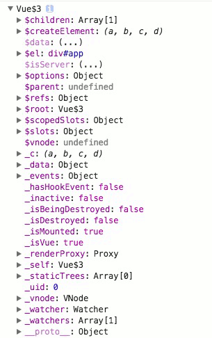
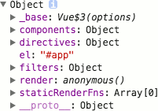
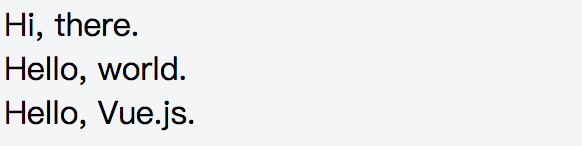

## 从一个奇怪的错误出发理解 Vue 基本概念

有人在学习 Vue 过程中遇到一个奇怪的问题，并为之迷惑不已——为什么这么简单的一个项目都会出错。

这是一个简单到几乎不能再简单的 Vue 项目，在 index.html 的 body 中有一个 id 为 app 的 div 根元素，其中包含一个 my-component 自定义标签。
```HTML
<div id="app">
  <my-component></my-component>
</div>
```
index.js 中引入 vue 及 MyComponent 单文件组件，然后运行 new Vue。
```JavaScript
import Vue from 'Vue'
import MyComponent from './components/MyComponent'

new Vue({
  el: '#app',
  components: {
    MyComponent
  }
})
```
MyComponent 组件包含一个 p 元素，以插值的形式绑定显示一个包含 `Hello World!` 字符串的数据。

项目用 webpack 打包，并使用 webpack-dev-server 启动开发服务器。webpack 配置文件内容如下：

```JavaScript
var path = require('path')
var HtmlWebpackPlugin = require('html-webpack-plugin')

module.exports = {
  entry: path.resolve(__dirname, 'index.js'),
  output: {
    path: path.resolve(__dirname, `dist`),
    publicPath: '',
    filename: 'index.js'
  },
  resolve: {
    extensions: ['.js', '.vue']
  },
  module: {
    loaders: [
      {
        test: /\.vue$/,
        loader: 'vue-loader'
      },
      {
        test: /\.js$/,
        loader: 'babel-loader',
        query: {
          presets: ['es2015']
        },
        exclude: /node_modules/
      }
    ]
  },
  plugins: [
    new HtmlWebpackPlugin({
      filename: 'index.html',
      template: path.resolve(__dirname, 'index.html'),
      inject: true
    })
  ]
}
```

运行 `npm run dev` 并访问 http://localhost:8080/ 后，从浏览器的控制台得到如下警告信息：

>[Vue warn]: Failed to mount component: template or render function not defined. 
(found in root instance)

令人百思不得其解的是，如果不使用 webpack 打包，而是直接在 HTML 文件中使用 script 标签引入 Vue.js，在 JavaScript 中手写 MyComponent 的组件选项模板，完成的页面却可以正确显示，为什么这里会提示“模板或渲染函数未定义”呢？

这其实与 Vue 的两种不同的构建有关，在上述使用 webpack 打包的项目需要使用独立构建的 Vue 库，而在 node_modules/vue/package.json 文件中，已经通过 main 属性指定了通过 `import Vue from 'vue'` 或 `require('vue')` 所引入的文件是 dist/vue.runtime.common.js，即运行时构建的 Vue 库。直接在 HTML 文件中使用 script 标签引入的是独立构建的 Vue 库，因此没有问题。

从 Vue 官方教程的 [Standalone vs. Runtime-only Build](http://vuejs.org/v2/guide/installation.html#Standalone-vs-Runtime-only-Build) 我们了解到 Vue 有两种不同的构建——独立构建和运行时构建。运行时构建删除了模板编译的功能，因此无法支持带 template 属性的 Vue 实例选项。但如果你不深入地去理解 Vue 的基本概念以及编译、挂载相关的过程，你可能仍然会很迷糊，为什么在这个项目中会有问题？

说到 Vue 的概念，不得不说起 Vue 实例，这是一个使用 Vue 构造函数创建的 JavaScript 对象，创建 Vue 实例时，传递给 Vue 构造函数的参数是一个包含若干属性和方法的对象，被称为 Vue 实例选项对象，用于声明所创建的 Vue 实例对象所要挂载的目标元素、data 数据、计算属性、模板/渲染函数、实例方法以及各种生命周期钩子回调函数等选项。创建的 Vue 实例既然是一个 JavaScript 对象，那么也必然拥有属性和方法，下图是 Vue 实例所包含的属性与方法的示例：



可以看出，Vue 实例的属性、方法与 Vue 选项对象的属性、方法差别很大，然而两者之间还是有关联的，比如，Vue 实例的 $el 属性是 Vue 选项对象中的 el 属性作为选择子所对应的 DOM 元素，Vue 实例的 $data 属性是 Vue 选项对象中的 data 属性（或工厂函数）经响应式处理后的对象，$options 属性则是经 Vue 构造函数处理过的 Vue 选项对象。

我们通过这两个对象间关系的分析，可以加深一下对 Vue 的一些基本概念的理解——模板/渲染函数、挂载点、独立构建/运行时构建、Event Bus。

首先是模板/渲染函数。Vue 官方教程的第四部分是模板语法，介绍了插值和指令，可以通过插值语法和 Vue 指令声明式地编写 Vue 模板，在教程的高级篇中，介绍了渲染函数，并说明了两者之间的关系。Vue 构造函数会将 Vue 模板编译成用于实现数据驱动的 DOM 渲染的渲染函数，开发者也可以直接手写渲染函数来发挥 JavaScript 的完全编程能力。

展开 Vue 实例的 $options 属性，可以进一步看到除了 el 和 components 之外，多了若干个其他属性和方法，其中就包含编译生成的render 渲染函数。



既然 Vue 构造函数在创建 Vue 实例时会将 template 编译成 render 渲染函数，但我们在调用 new Vue 时的 Vue 选项对象中并没有包含 template 属性，那么 templage 模板是从哪儿来的呢？

这涉及到 Vue 选项对象中的 el 属性、template属性和 render 渲染函数的关系问题，当 Vue 选项对象中有 render 渲染函数时，Vue 构造函数将直接使用渲染函数渲染 DOM 树，当选项对象中没有 render 渲染函数时，Vue 构造函数首先通过将 template 模板编译生成渲染函数，然后再渲染 DOM 树，而当 Vue 选项对象中既没有 render 渲染函数，也没有 template 模板时，会通过 el 属性获取挂载元素的 outerHTML 来作为模板，并编译生成渲染函数。

换言之，在进行 DOM 树的渲染时，render 渲染函数的优先级最高，template 次之且需编译成渲染函数，而挂载点 el 属性对应的元素若存在，则在前两者均不存在是，其 outerHTML 才会用于编译与渲染。 

下面我们通过创建三个不同的 Vue 实例来验证一下：

html 页面 body 内容：
```html
<div class="app1">{{msg}}</div>
<div class="app2">{{msg}}</div>
<div class="app3">{{msg}}</div>
```
分别创建 Vue 实例的代码：
```javascript
new Vue({
  el: '.app1',
  data: {
    msg: 'Hello, Vue.js.'
  },
  template: '<div>Hello, world.</div>',
  render: (h) => h('div', {}, 'Hi, there.')
})

new Vue({
  el: '.app2',
  data: {
    msg: 'Hello, Vue.js.'
  },
  template: '<div>Hello, world</div>'
})

new Vue({
  el: '.app3',
  data: {
    msg: 'Hello, Vue.js.'
  }
})
```
结果如下：


通过上述说明，可以很容易地理解 Vue 的独立构建和运行时构建这两个概念，所谓独立构建是指能够将 template 模板或者从 el 挂载元素提取的模板编译成渲染函数的 Vue 库，而运行时构建则是指不能进行模板编译的 Vue 库。

使用运行时库主要是为了减少体积，同时强制预编译所有模板，实现前端优化，Vue 的 npm 包也将 package.json 中的 main 指向了运行时构建 `dist/vue.runtime.common.js`，在按模块化方式引用或打包时默认使用运行时构建。

什么场合使用独立构建，什么场合使用运行时构建，针对这个问题，只需要考虑清楚在项目中是否使用了模板编译功能。

在包含单文件组件的项目中，使用 webpack 打包时已经将单文件组件中的模板预先编译成了渲染函数，因此一般情况下使用运行时构建的 Vue 库就可以了，但如果在使用 new Vue 创建 Vue 的根实例时，模板是从 el 挂载元素提取的，则需要使用独立构建的 Vue 库。

在使用 script 标签引入 Vue.js 的项目中，任意实例选项或组件选项中包含了 template 模板属性或从 el 挂载元素提取的模板时，均需要使用独立构建的 Vue 库。

要解决本文最开始的问题，需要在 webpack 配置中的 resolve 属性对象中添加如下 alias 设置：
```javascript
module.exports = {
  // ... other options
  resolve: {
    extensions: ['.js', '.vue'],
    alias: {
      'vue$': 'vue/dist/vue.common.js'
    }
  },
  // ... other options
}
```

这里的 `vue$` 表示精确匹配，由于 `index.js` 中还有一处大小写错误 `import Vue from 'Vue'`，因此需要将 `from` 后面的 `'Vue'` 修改为小写的 `'vue'` 之后页面才能正确显示。

下面再考虑一个问题：构建Vue 实例时，Vue 选项中 el 属性、template属性和 render 渲染函数是否三者必有其一？

答案是不一定，可以使用不包含 el 属性、template属性和 render 渲染函数的实例选项创建 Vue 实例，事实上，如果在 Vue 实例选项中既没有设置 el 挂载点属性也没有显式调用 $mount 方法，是不会触发对 render 渲染函数（无论是手工编写还是编译生成）的检查的。

比较常见的是应用场景是为实现多组件间通信而创建的 Event Bus。

创建 Event Bus：
```javascript
import Vue from 'vue'

export const EventBus = new Vue()
```
然后就可以根据需要给 Event Bus 添加事件响应：
```javascript
import EventBus from 'event-bus.js'

EventBus.$on('customEvent1', function (...params) {
  // ...
})
```
并在需要的时候触发事件：
```javascript
import EventBus from 'event-bus.js'

// ...

EventBus.$emit('customEvent1', ...params)
```
这样可以简单解决非父子组件之间通信的需求。
